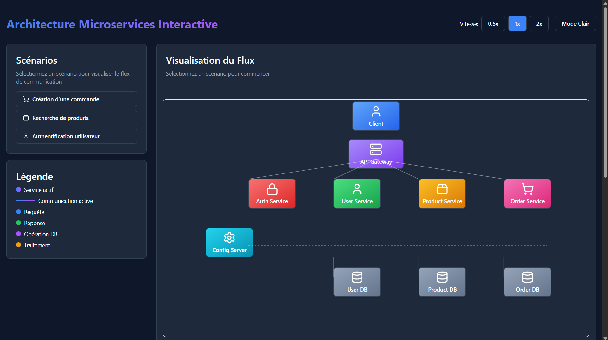
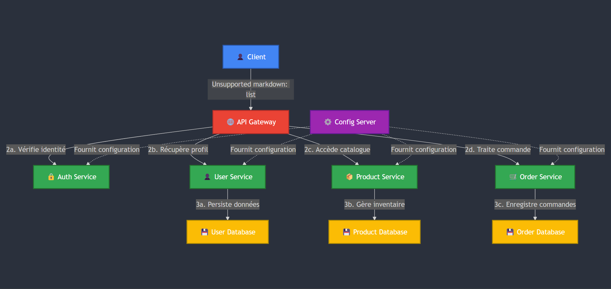

### 🚀 Microservices Architecture Visualizer

<div align="center">
  


**Une visualisation interactive et animée de l'architecture microservices**



</div>

## ✨ Caractéristiques

- 🔄 **Animations fluides** des communications entre services
- 🌓 **Mode sombre/clair** pour une expérience utilisateur optimale
- 📊 **Visualisation en temps réel** des flux de données
- 📝 **Logs détaillés** des communications entre services
- 🧩 **Architecture modulaire** facile à comprendre et à étendre
- 📱 **Design responsive** pour tous les appareils


## 📖 À propos

Ce visualiseur d'architecture microservices permet de comprendre de manière interactive comment les différents services d'une application moderne communiquent entre eux. Grâce à des animations visuelles et des explications détaillées, il devient facile de saisir les concepts fondamentaux des microservices.

### 🎬 Scénarios disponibles

| Scénario | Description | Complexité
|-----|-----|-----
| 🛒 **Création d'une commande** | Visualisez comment une commande est créée à travers plusieurs services | ⭐⭐⭐
| 🔍 **Recherche de produits** | Découvrez le flux de recherche de produits | ⭐⭐
| 🔐 **Authentification utilisateur** | Comprenez le processus d'authentification sécurisé | ⭐⭐


## 🛠️ Installation

```shellscript
# Clonez le dépôt
git clone git@github.com:OumaymaBrd/Architecture-Microservices-Interactive.git

# Accédez au répertoire du projet
cd microservices-visualizer

# Ouvrez index.html dans votre navigateur
# Aucune dépendance à installer !
```

## 🏗️ Architecture du code

```plaintext
microservices-visualizer/
├── index.html              # Structure HTML principale
├── css/
│   └── styles.css          # Styles CSS
├── js/
│   ├── tailwind-config.js  # Configuration Tailwind CSS
│   ├── data.js             # Données des scénarios
│   ├── utils.js            # Fonctions utilitaires
│   ├── animation.js        # Logique d'animation
│   └── main.js             # Initialisation et événements
└── README.md               # Documentation
```

### 📊 Flux de données

<div align="center">
  <h4>Une visualisation interactive des communications entre microservices</h4>
  
  
  
  <p><em>Schéma illustrant les interactions entre les différents services et bases de données</em></p>
</div>

## 🎮 Comment utiliser

1. **Choisissez un scénario** parmi les options disponibles
2. **Observez les animations** montrant le flux de données entre les services
3. **Lisez les explications** qui apparaissent à chaque étape
4. **Consultez les logs** pour comprendre les communications techniques
5. **Ajustez la vitesse** d'animation selon vos préférences


## 🧩 Structure des microservices

| Service | Rôle | Base de données
|-----|-----|-----
| 🌐 **API Gateway** | Point d'entrée unique, routage des requêtes | -
| 🔒 **Auth Service** | Gestion de l'authentification et des autorisations | -
| 👤 **User Service** | Gestion des utilisateurs et profils | MongoDB
| 📦 **Product Service** | Catalogue de produits et inventaire | PostgreSQL
| 🛒 **Order Service** | Traitement des commandes | MySQL
| ⚙️ **Config Server** | Configuration centralisée | -


## 🔧 Personnalisation

Vous pouvez facilement personnaliser cette visualisation :

### Ajouter un nouveau scénario

Modifiez le fichier `js/data.js` pour ajouter un nouveau scénario :

```javascript
const scenarios = {
  // Scénarios existants...
  
  monNouveauScenario: {
    name: "Nom du scénario",
    steps: [
      // Définissez les étapes ici
    ]
  }
}
```

### Modifier l'apparence

Personnalisez les styles dans `css/styles.css` ou modifiez la configuration Tailwind dans `js/tailwind-config.js`.

## 📚 Concepts de microservices illustrés

- **Découplage** : Chaque service a une responsabilité unique
- **Résilience** : Les services peuvent fonctionner indépendamment
- **Scalabilité** : Chaque service peut être mis à l'échelle séparément
- **Communication asynchrone** : Les services communiquent via des messages
- **Base de données par service** : Chaque service gère ses propres données


## 🌟 Avantages des microservices

- ✅ **Développement parallèle** par plusieurs équipes
- ✅ **Déploiement indépendant** de chaque service
- ✅ **Isolation des pannes** pour une meilleure résilience
- ✅ **Choix technologique flexible** pour chaque service
- ✅ **Mise à l'échelle précise** selon les besoins


## 🤝 Contribution

Les contributions sont les bienvenues ! N'hésitez pas à :

1. Fork le projet
2. Créer une branche pour votre fonctionnalité (`git checkout -b feature/amazing-feature`)
3. Commit vos changements (`git commit -m 'Add some amazing feature'`)
4. Push vers la branche (`git push origin feature/amazing-feature`)
5. Ouvrir une Pull Request


## 📜 Licence

Distribué sous la licence MIT. Voir `LICENSE` pour plus d'informations.

## 📞 Contact

Oumayma Bramid-  [oumaymabramid@gmail.com](mailto:oumaymabramid@gmail.com)

Lien du projet: [https://github.com/OumaymaBrd/Architecture-Microservices-Interactive](https://github.com/OumaymaBrd/Architecture-Microservices-Interactive)